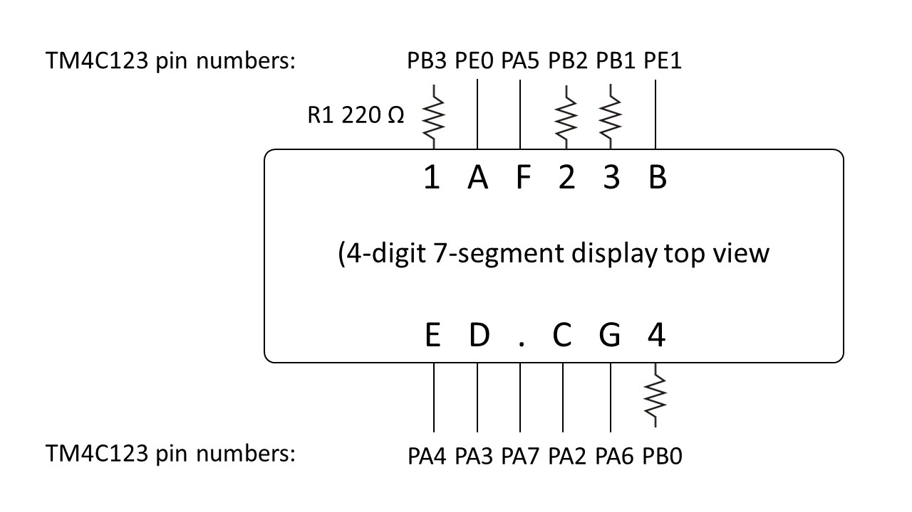

# sonic-ruler-rtos
Sonic ruler implemented using FreeRTOS on the TM4c123GH6PM (on the Tiva Launchpad) to allow display to remain visually stable; this is one way to fix the display flickering problem in the non-RTOS version.

Credit for `startup_tm4c_gnu.c`, `TM4C123GH6PM.h`, and `tm4c123gh6pm.lds` goes to Quantum Leaps' Modern Embedded Systems Programming Video Course.

## Build
Built with GNU toolchain in Code Composer Studio.
You will have to add `heap2.c, list.c, tasks.c, port.c (FreeRTOS/Source/portable/GCC/ARM-CM4F/port.c)` to your project in order to build, as well as add `FreeRTOS/Source/portable/GCC/ARM-CM4F/, FreeRTOS/Source/include` to your include paths. Note that the MPU port is not being used. Also requires `CMSIS/Core/Include` from the ti CMSIS library.

## Schematics
### Common cathode 4-digit 7-segment display pin connections:

  

Note that the above circuit assumes that only one digit is active at a time, i.e. that only one of pins 1, 2, 3, and 4 are low at one time. Multiple active digits may burn the circuit.
